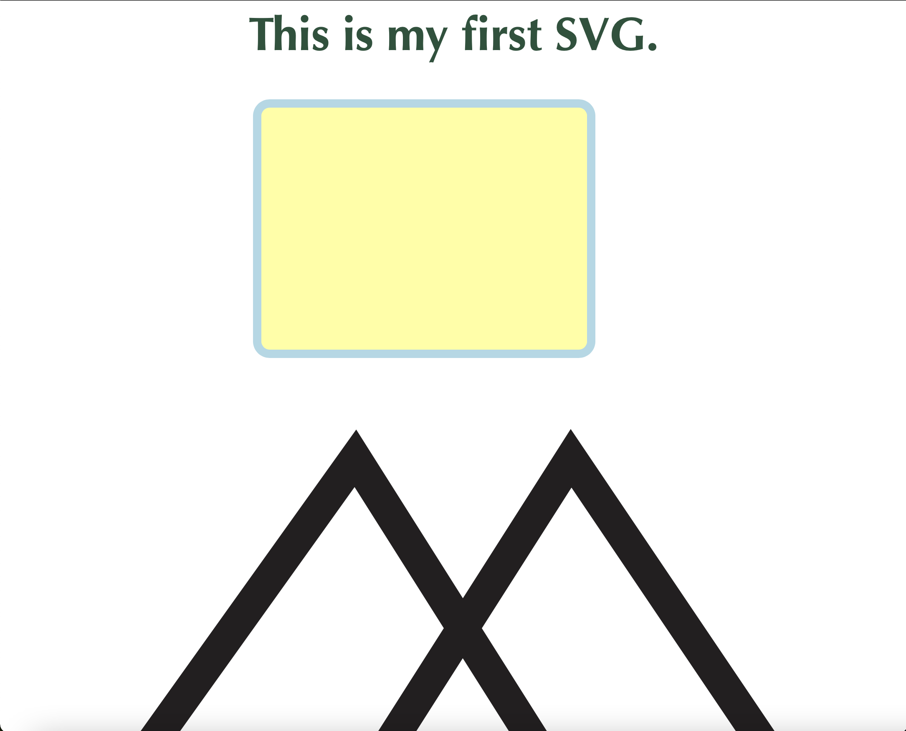

# Intro to HTML  
Return to [Home Page](README.md)  
Other pages: [Python](pythonbeginnings.md) | [Turtle Graphics](TurtleGraphics.md) | [JavaScript](JavaScript.md)

A few weeks into the _INFOTEC 1000_ course, we also learned how to code a bit of [HyperText Markup Language (HTML)](https://en.wikipedia.org/wiki/HTML) in order to imbed a [Scalable Vector Graphics (SVG)](https://en.wikipedia.org/wiki/Scalable_Vector_Graphics). HTML is a markup language that is used to be displayed on the web. We learned parts of HTML because a SVG must be embedded into the HTML to work.

This section of the course was meant to introduce us to concept of SVGs and the interworkings of webpages. SVGs are commonly used because they are:  
* vector based  
* easy to use with various languages (**W3C standard**)  
* can be used for various designs  

Some example code for a rectangle is shown here:
><rect x="300" y="10" rx="15" ry=:15" width="400" height="300" style="fill:yellow;stroke:lightblue;stroke-width:10;fill-opacity:0.5;strokeopacity:0.5" />   

The output of the full code looks like this in a web browser:  
  
_(Note: the bottom of the full SVG is cut off due to the size of the image.)_  

This concludes my introduction to HTML experience. Thank you for reading!