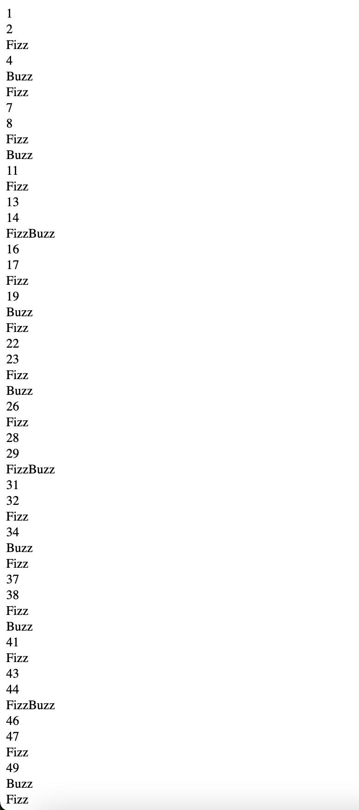

# JavaScript Beginnings
Return to [Home Page](README.md)  
Other pages: [Python](pythonbeginnings.md) | [Turtle Graphics](TurtleGraphics.md) | [HTML](HTMLbeginnings.md)

For this assignment of _IT 1000_, we were expected to learn **JavaScript** and brush up on **HTML**. If you want to read more about my HTML beginnings, check [here](HTMLbeginnings.md). [JavaScript](https://en.wikipedia.org/wiki/JavaScript) is a languages that is often used in conjunction to HTML and CSS for webpages.

For this challenge, I was expected to write a program based off of the FizzBuzz game. This happens to be a challenge used for interviewing programmer job applicants. In this case, I was expected to write this program in order to:
* understand the basics of JavaScript and its interaction with HTML  
* show our programming proficientcy  
* be able understand how to use a plain text editor  

The code is shown below:
>function fizzbuzz() {  
>	var display = document.getElementById('display');  
>	var displayHTML = "";  
>	for (i = 1; i < 101; i++) {  
>		if (i % 15 === 0) {  
>			document.write("FizzBuzz" + "br");  
>		} else if (i % 3 === 0) {  
>			document.write("Fizz" + "br");  
>		} else if (i % 5 === 0) {  
>			document.write("Buzz" + "br");  
>		} else {  
>			document.write(i + "br");  
>		}  
>		displayHTML += "p" + i + "/p";  
>	}  
>	display.innerHTML = displayHTML  
>}  

The expected output looks like this:
