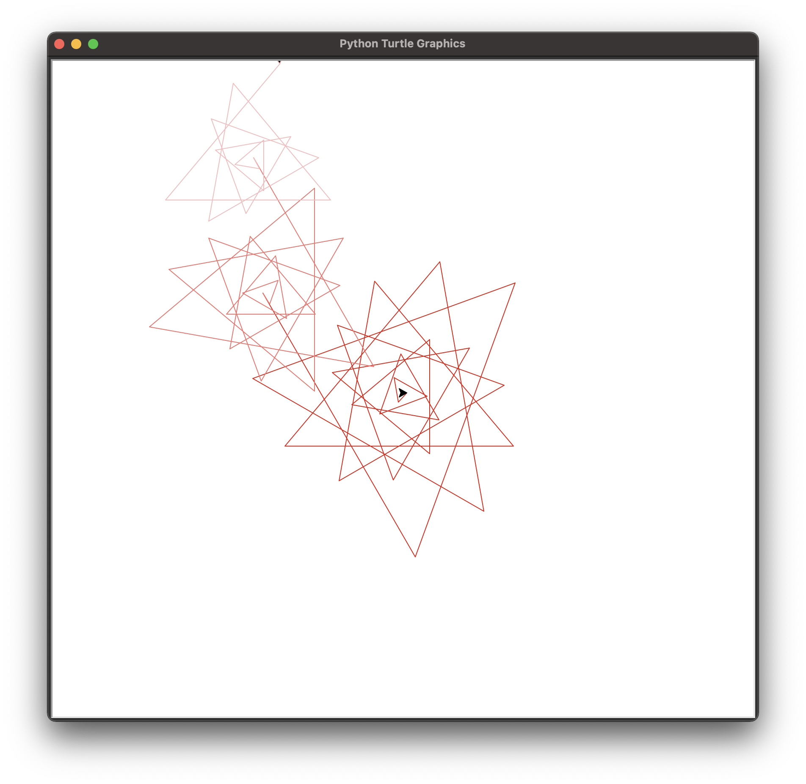

# Turtle Graphics
Return to [Home Page](README.md)  
Other pages: [Python](pythonbeginnings.md) | [JavaScript](JavaScript.md) | [HTML](HTMLbeginnings.md)

**[Turtle graphics]**(https://en.wikipedia.org/wiki/Turtle_graphics)) are a form of vector graphics that was often used to [introduce programming to children](https://docs.python.org/3/library/turtle.html). For this challenge in _IT 1000_, we were instructed to create images by using Python to program the Turtle graphics. For more about my usage of Python, check [here](pythonbeginnings.md).

Here is a common example of a Turtle graphic:  

For this challenge, Turtle graphics were used in order to teach us:
* how Python can be used for varying functions  
* be able to use code to create an image
* understand the usage of Turtle graphics

The code I used is shown below:
> import turtle  
>flower = turtle.Turtle()  
>ANIMATION_SPEED = 10  
>#main red flower  
>flower.pencolor("#DC1C13")  
>for i in range(25):  
    >flower.forward(i * 15)  
    >flower.right(130)  
>#medium pink flower  
>flower.pencolor("#F07470")  
>for i in range(20):  
    >flower.backward(i * 15)  
    >flower.left(130)  
>#smaller pink flower  
>flower.pencolor("#F6BDC0")  
>for i in range(15):  
    >flower.forward(i*15)  
    >flower.right(130)  
>turtle.speed(ANIMATION_SPEED)  
>turtle.done()  

The output of this code results in this image:
