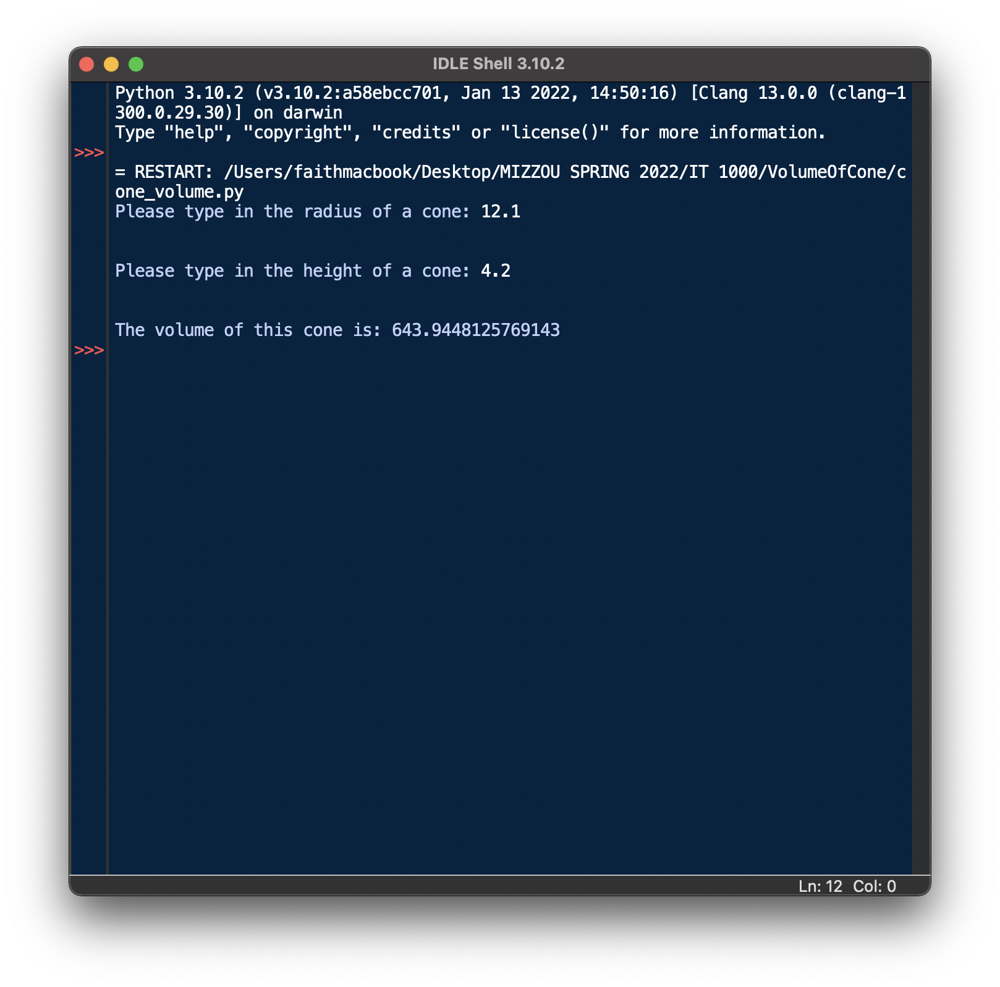

# First Projects
Return to [Home Page](README.md)  
Other pages: [JavaScript](JavaScript.md) | [Turtle Graphics](TurtleGraphics.md) | [HTML](HTMLbeginnings.md)

This is a page about one of my first coding projects for _IT 1000_. The one of the first things I coded was a simple program in [Python](https://en.wikipedia.org/wiki/Python_(programming_language) called **Volume of a Cone**. Python is a progamming language that uses indentation for readability. 

This code is supposed to calculate the volume of a cone. This project is supposed to teach us:  
* The basics of Python
* How to use Python to solve math problems
* How to use _while loops_ in Python  
* How to get user input  

The code is as shown below:

>import math

>def main():  
    >while True:  
        >try:  
            >radius = float(input("Please type in the radius of a cone: "))  
        >except ValueError:  
            >print("Please enter only a numerical value for the radius.")  
            >continue  
        >if (radius <= 0):  
            >print("Please enter a positive value for the radius.")  
            >continue  
        >else:  
            >break  
    >print("\n")  
    >while True:  
        >try:  
            >height = float(input("Please type in the height of a cone: "))  
        >except ValueError:  
            >print("Please enter only a numerical value for the height.")  
            >continue  
        >if (height <= 0):  
            >print("Please enter a positive value for the height.")  
            >continue  
        >else:  
            >break  
    >print("\n")  
    >volume = math.pi * (radius**2) * (height/3)  
    >print("The volume of this cone is: ", end="")  
    >print(volume)  
>main()  

The output of this code would result in this:
